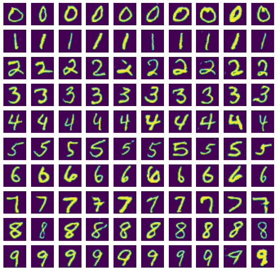
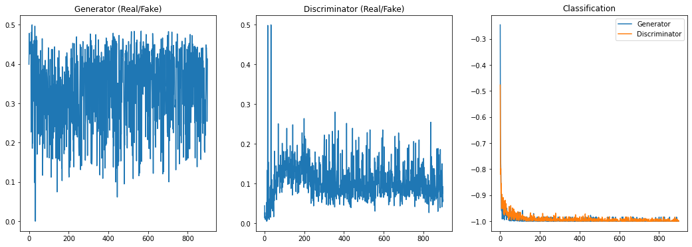
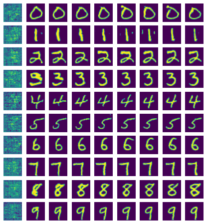
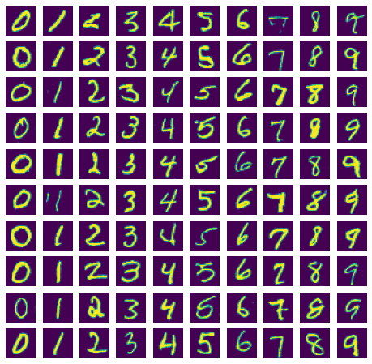

ACGAN (Auxiliary Classifier GAN) with MNIST
=============

## Model
### Generator:  
> Embedding: take a label as input → return a vector of same dimension as latent vector
> Elementwise product between latent vector and output of embedding layer
> Conv #1: ConvT(nz, 4*ngf, 4, 1, 0) → BatchNorm → ReLU  
> Conv #2: ConvT(4*ngf, 2*ngf, 3, 2, 1) → BatchNorm → ReLU  
> Conv #3: ConvT(2*ngf, ngf, 4, 2, 1) → BatchNorm → ReLU  
> Conv #4: ConvT(ngf, nc, 4, 2, 1) → Tanh  
(nz: dimension of latent vector, ngf: # of features of genetator, nc: # of channels)  
  
### Discriminator:  
> Conv #1: Conv(nc, ndf, 4, 2, 1) → LeakyReLU(0.2)  
> Conv #2: Conv(ndf, 2*ndf, 4, 2, 1) → BatchNorm → LeakyReLU(0.2)  
> Conv #3: Conv(2*ndf, 4*ndf, 3, 2, 1) → BatchNorm → LeakyReLU(0.2)  
> FC (real/fake): Linear(64*ndf, 1) → Sigmoid  
> FC (class): Linear(64*ndf, 10) → Softmax
(ndf: # of features of discriminator)  

### Gan Loss: Mean Squared Error (MSE)
  
------------------
## Output Images  
  

------------------
## Loss  
  

------------------
## How Generator improved  
  

------------------
## Make digits with same latent vector 
  
